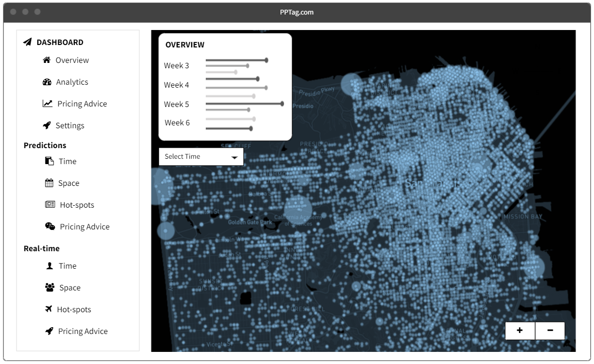
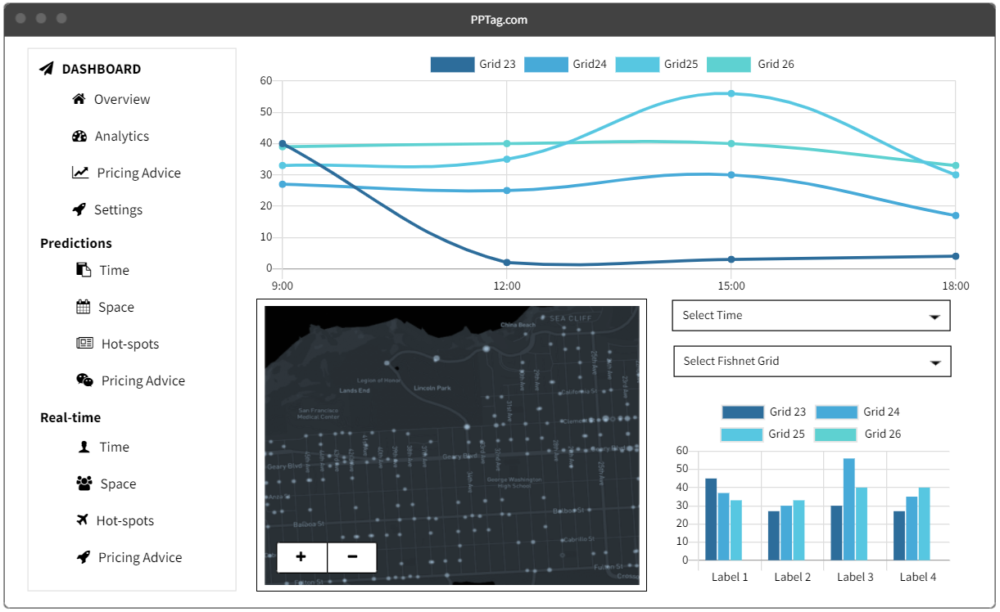

---

# 1. Introduction and Background

The City and County of San Francisco, is a cultural, commercial, and financial center in the US state of California. Located in Northern California, San Francisco is the fourth most populous city in California, with 873,965 residents as of 2020. For the San Francisco metropolitan area, it is the 12th-largest metropolitan statistical area in the US with about 4.7 million residents, and the fourth-largest by economic output, with a GDP of \$592 billion in 2019.

San Francisco is also a popular tourist destination, which is known for its cool summers, fog, steep rolling hills, eclectic mix of architecture, and landmarks, including the Golden Gate Bridge, cable cars, the former Alcatraz Federal Penitentiary, Fisherman's Wharf, and its Chinatown district. With so many famous resorts, San Francisco attracts over 26.5 million visitors in 2019.

Fig. x Map of neighborhoods in San Francisco

With such a large population and huge number of visitors, it is extraordinarily difficult to find a parking space in San Francisco, especially in the downtown San Francisco, or near the tourist destinations. Most residents as well as visitors have experienced cruising and cruising on the street to find just a place to accommodate their car. On-street parking hot spots cluster in the northeastern section of San Francisco, including Financial District, China Town, Fisherman's Wharf, etc., where many commercial hot spots also gather here.

To make the situation worse, San Francisco is also experiencing severe congestion every day, and San Francisco was ranked as the fifth-worst city in the world and third-worst in the nation when it came to traffic congestion in 2017, according to [a study](https://inrix.com/scorecard/). San Francisco Congestion Management Agency (SFCMA) has made great effort to reduce congestion, including their congestion management program and charging drivers for entering downtown San Francisco in specific time periods. Parking shortage and congestion really bring terrible experience for both residents and tourists.

To solve the problem of parking shortage, the San Francisco Municipal Transportation Agency (SFMTA) has made great effort, and one of the effective methods is to carry out a better pricing plan for on-street parking. San Francisco is one of the first cities to apply a dynamic park pricing method, many on-street parking meters only operate from Monday to Saturday, between 9am and 6pm. The parking fee rate differs by the day of the week and time of day. Generally, the parking fee rate in San Francisco is shown in the table below.

Table 1 Current Parking Fee Rate in San Francisco

# 2. Use Case

## 2.1 General Use Case

For this project, our main stakeholder is SFMTA which operates most of the on-street parking in San Francisco. We want to carry out a prediction model to help SFMTA with parking pricing process.

Many researchers and planners believe that parking is underpriced in the US, and therefore leading to parking shortage and overuse of parking facilities. According to Donald Shoup (2004), when curbside parking spaces are overcrowded, and vacant spaces are unavailable, drivers "cruise" in search of parking. Cruising creates negative externalities including congestion, air pollution and unnecessary fuel consumption. If the parking price can cooperate with the parking demand and keep an on-street parking vacancy of 20-30%, cruising will be significantly reduced. Thus, it is of vital importance to carry out suitable pricing method for on-street parking in San Francisco, and the demand-based dynamic pricing model is a good choice.

## 2.2 Demand-based Dynamic Pricing Model

The model works as follows, SFMTA sets a floating price according to a real-time demand or predicted demand, so that parking demand and supply can be balanced to keep a on-street parking vacancy of about 20-30%, minimizing the time it takes to find parking and minimizing the negative externalities.

To take full use of the demand-based dynamic pricing model, we need to identify the parking demands. Compared to real-time parking demands from the real-time parking data, predictions of parking demands can help SFMTA adjust their parking fee rate in advance, before the upcoming parking peaks, so that they can make more reasonable changes in price.

## 2.3 Our Goals

In this project, we aim to carry out a demand prediction model with satisfying spatio-temporal accuracy and generalizability in San Francisco region. Then we'd apply the prediction result of this model in the demand-based dynamic pricing model and design an APP to manage parking congestion through price manipulation in order to optimize occupancy and reduce traffic congestion. On top of that, our goal is also to make the overall revenues rise, occupancy move towards target ranges on most streets and price changes have the intended impact on driver behavior in San Francisco.

# 3. Data Wrangling and Feature Engineering

# 4. Exploratory Analysis

In this part, we focus on the exploratory analysis on our data, and try to figure out a suitable model according to the spatial and temporal pattern of the parking transactions.

{r parking by week}

Firstly, we examine the temporal distribution of the parking data. We plot the parking transactions by time with an interval of 60 minutes. The parking data shows a similar pattern of peaks and troughs every day and week, except weekends when on-street parking is free. Since we split the data in the last part, we give different color to the training and testing set of our data to be clearer and more precise.

{r time lag correlation}

Here we examined the correlation of parking data and the four time lags features we generated above. As is shown in the plot, lag of one hour has the best positive relationship with the original data, followed by lag of 2 hours and lag of one day. This can be interpreted that the nearer the time lag and the original time is, the more similar in parking data. Since there is an everyday pattern of parking data as well, we can see lag of one day also have a strong positive relationship with the original data, indicating we can use this as a feature in the model later.

{r spatial correlation map by week}

To illustrate the spatial pattern of on-street parking data, we make the maps of parking numbers in fishnet grids by week. The parking records cluster in the north of the study region, showing a similar pattern every week.

{r spatial correlation map by dotw}

We also make the maps of parking numbers in fishnet grids by the day of week to illustrate the temporal patten of every day in a week. As is shown below, most parking lots are for free on Sundays. On Saturdays, there are more parking demands than usual weekdays, especially in the central of the study region. On weekdays, the results are quite similar.

{r Space/time correlation gif}

We generate a .gif to show the changing of parking numbers in both space and time.

# 5. Modeling and Validation

# 6. Applications

As is discussed above, we carry out a regression model to predict the future parking demands in San Francisco, and we reach a satisfying accuracy. This prediction model serves as important data source for the demand-based dynamic pricing model. In our model, we input the parking numbers in each fishnet grid, together with the features of built environment, neighborhood, and road characteristics, and get the output of parking numbers for each grid 1 hour later. Then we transform the parking numbers into on-street parking vacancy in each grid by dividing the number of meters in each grid. According to the vacancy, we can give our advise on pricing strategies to SFMTA.

Considering our use case, we develop a web-based APP towards SFMTA, and the user interface is shown as follows.

Fig. x Spatial Interface of the Webpage

In this page (Fig. x), the APP gives a general sense of the spatial distribution of on-street parking demand. The time span can be selected by the selector, both real-time and predicted parking demand are integrated into this page.

Fig. x+1 Temporal Interface of the Webpage

In the page above (Fig. x+1), the APP focuses on the temporal distribution of the parking demand. Line charts and bar charts are applied to illustrate the change of parking demand across time. Users can also select the specific time series and fishnet grid ID with the selectors. When users click on Pricing Advice in the left bar, suggestions show up automatically according to the model prediction results.

Fig. x+2 Revenue Analysis Interface of the Webpage

In this page (Fig. x+2), we visualize the revenue analysis based on the dynamic pricing model. The line chart here shows the change of accumulative parking revenue with time of the day. Users can also select the specific date and fishnet grid and generate the visualizations. The pie chart above shows the portion of each fishnet grid's revenue.

# 7. Conclusions

In this project, we applied linear regression model and poisson regression model in predicting the on-street parking demands in San Francisco. Our linear model reaches a R2 of ..., while the poisson model's R2 is .... {briefly describe the model choice}.

Based on our model, SFMTA can more easily predict the demand of on-street parking, and adjust the parking fee rate in advance to prevent on-street parking from being overpriced or underpriced, so as to increase their revenue as well as reduce negative externalities brought by lack of parking lots.

In the future, we can keep improving the model accuracy by importing feature data with higher spatial and temporal resolution. Other relevant feature data can also be applied to the model, which will probably add to model accuracy as well. We can also apply the model to the whole city of San Francisco, rather than the limited selected regions, to achieve a better generalizability.
