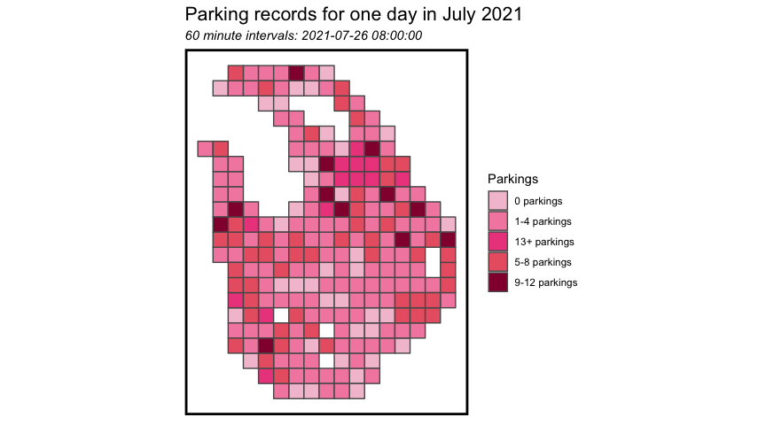
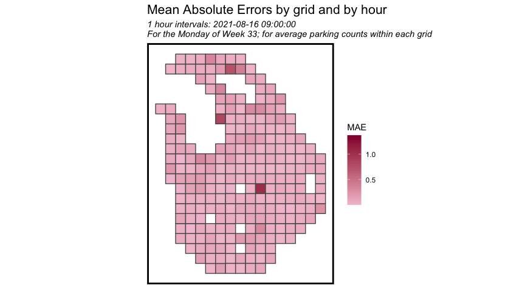

**Presentation Video Link**:

```{r setup, include=FALSE}
knitr::opts_chunk$set(echo = TRUE, warning = FALSE, results = FALSE, message = FALSE)
```

```{r library}
# set up
library(tidyverse)
library(sf)
library(lubridate)
library(tigris)
library(tidycensus)
library(gganimate)
library(viridis)
library(riem)
library(gridExtra)
library(knitr)
library(kableExtra)
library(RSocrata)
library(caret)
library(purrr)
library(FNN)
library(stargazer)
library(dplyr)
library(spatstat)
library(raster)
library(spdep)
library(grid)
library(mapview)
library(gifski)
library(gganimate)
library(riem)
library(cowplot)
library(ggcorrplot)
library(MASS)


palette5 <- c('#24b3cb', '#21a1c1', '#1d8fb7', '#167dae', '#0c6ca4')
palette5_2 <- c('#24b3cb', '#5896bb', '#9d94b7', '#d98aae', '#ec4c8c')
palette5_3 <- c('#f3c3d3', '#f38caf', '#ec4c8c', '#ea6372', '#93003a')
palette4 <- c("#24b3cb","#0c6ca4","#F3c3d3","#ec4c8c")
palette3 <- c("#24b3cb","#F3c3d3","#ec4c8c")
#palette4_2 <- c("#83c8f9","#2984c3","#075d9a","#000066")
palette2 <- c("#24b3cb","#ec4c8c")

source("https://raw.githubusercontent.com/urbanSpatial/Public-Policy-Analytics-Landing/master/functions.r")

```

# 1. Introduction and Background

The City and County of San Francisco, is a cultural, commercial, and financial center in the US state of California. Located in Northern California, San Francisco is the fourth most populous city in California, with 873,965 residents as of 2020. For the San Francisco metropolitan area, it is the 12th-largest metropolitan statistical area in the US with about 4.7 million residents, and the fourth-largest by economic output, with a GDP of \$592 billion in 2019.

San Francisco is also a popular tourist destination, which is known for its cool summers, fog, steep rolling hills, eclectic mix of architecture, and landmarks, including the Golden Gate Bridge, cable cars, the former Alcatraz Federal Penitentiary, Fisherman's Wharf, and its Chinatown district. With so many famous resorts, San Francisco attracts over 26.5 million visitors in 2019.


Fig. 1 Map of neighborhoods in San Francisco

With such a large population and huge number of visitors, it is extraordinarily difficult to find a parking space in San Francisco, especially in the downtown San Francisco, or near the tourist destinations. Most residents as well as visitors have experienced cruising and cruising on the street to find just a place to accommodate their car. On-street parking hot spots cluster in the northeastern section of San Francisco, including Financial District, China Town, Fisherman's Wharf, etc., where many commercial hot spots also gather here.

To make the situation worse, San Francisco is also experiencing severe congestion every day, and San Francisco was ranked as the fifth-worst city in the world and third-worst in the nation when it came to traffic congestion in 2017, according to [a study](https://inrix.com/scorecard/). San Francisco Congestion Management Agency (SFCMA) has made great effort to reduce congestion, including their congestion management program and charging drivers for entering downtown San Francisco in specific time periods. Parking shortage and congestion really bring terrible experience for both residents and tourists.

To solve the problem of parking shortage, the San Francisco Municipal Transportation Agency (SFMTA) has made great effort, and one of the effective methods is to carry out a better pricing plan for on-street parking. San Francisco is one of the first cities to apply a dynamic park pricing method, many on-street parking meters only operate from Monday to Saturday, between 9am and 6pm. The parking fee rate differs by the day of the week and time of day. Generally, the parking fee rate in San Francisco is shown in the table below.

Table 1 Current Parking Fee Rate in San Francisco


# 2. Use Case

## 2.1 General Use Case

For this project, our main stakeholder is SFMTA which operates most of the on-street parking in San Francisco. We want to carry out a prediction model to help SFMTA with parking pricing process.

Many researchers and planners believe that parking is underpriced in the US, and therefore leading to parking shortage and overuse of parking facilities. According to Donald Shoup (2004), when curbside parking spaces are overcrowded, and vacant spaces are unavailable, drivers "cruise" in search of parking. Cruising creates negative externalities including congestion, air pollution and unnecessary fuel consumption. If the parking price can cooperate with the parking demand and keep an on-street parking vacancy of 20-30%, cruising will be significantly reduced. Thus, it is of vital importance to carry out suitable pricing method for on-street parking in San Francisco, and the demand-based dynamic pricing model is a good choice.

## 2.2 Demand-based Dynamic Pricing Model

The model works as follows, SFMTA sets a floating price according to a real-time demand or predicted demand, so that parking demand and supply can be balanced to keep a on-street parking vacancy of about 20-30%, minimizing the time it takes to find parking and minimizing the negative externalities.

To take full use of the demand-based dynamic pricing model, we need to identify the parking demands. Compared to real-time parking demands from the real-time parking data, predictions of parking demands can help SFMTA adjust their parking fee rate in advance, before the upcoming parking peaks, so that they can make more reasonable changes in price.

## 2.3 Our Goals

In this project, we aim to carry out a demand prediction model with satisfying spatio-temporal accuracy and generalizability in San Francisco region. Then we'd apply the prediction result of this model in the demand-based dynamic pricing model and design an APP to manage parking congestion through price manipulation in order to optimize occupancy and reduce traffic congestion. On top of that, our goal is also to make the overall revenues rise, occupancy move towards target ranges on most streets and price changes have the intended impact on driver behavior in San Francisco.

# 3. Data Wrangling and Feature Engineering

## 3.1 Loading and wrangling data

We select six weeks, which is 07/16/2021 - 08/26/2021 (week 29 - week 34), as the time window to train and test models. First, load and wrangle on-street parking data of meters and records. As it is plotted below, most of the on-street parking behaviors cluster in the northeastern section of San Francisco, including the famous Fisherman's Wharf, where the daytime parking occupancy is closer to 80% and traffic congestion is more serious. Thus, we trimmed our study area into these ***seven neighborhoods***: North Beach, Russian Hill, Nob Hill, Chinatown, Financial District/South Beach, Tenderloin, South of Market.

```{r load data1}
# import SF neighborhood boundaries
neighborhood_sf <-
  st_read("local_data_source/Analysis Neighborhoods.geojson") %>%
  st_as_sf(coords = the_geom.coordinates, crs = 4326, agr = "constant") %>%
  st_transform('ESRI:102243')

# import meters data
meters <-
  read.socrata("https://data.sfgov.org/resource/8vzz-qzz9.json") %>%
  dplyr::select(post_id, street_id, longitude, latitude) %>%
  na.omit()

meters_sf <-
  meters %>%
  st_as_sf(coords = c("longitude", "latitude"), crs = 4326, agr = "constant") %>%
  st_transform('ESRI:102243')

# import street park records in a specific time span
street_parks <- 
  read.socrata("https://data.sfgov.org/resource/imvp-dq3v.json?$where=session_start_dt between '2021-07-16T00:00:00' and '2021-08-27T00:00:00'") %>%
  na.omit() %>%
  merge(meters, by="post_id")

street_parks_sf <-
  street_parks %>%
  st_as_sf(coords = c("longitude", "latitude"), crs = 4326, agr = "constant")  %>%
  st_transform('ESRI:102243')

# Off-street Parking
off_parking <-
  read.socrata("https://data.sfgov.org/resource/vqzx-t7c4.json") %>%
  dplyr::select(objectid, osp_id, street_address, owner, capacity, main_entrance_long, main_entrance_lat) %>%
  na.omit() 

off_parking_sf <-
  off_parking %>%
  st_as_sf(coords = c("main_entrance_long", "main_entrance_lat"), crs = 4326, agr = "constant") %>%
  st_transform('ESRI:102243')


# select the study regions
selected_nhoods_list = c("North Beach", "Russian Hill", "Nob Hill", "Chinatown",
                    "Financial District/South Beach", "Tenderloin", "South of Market")
selected_nhoods_sf <-
  neighborhood_sf %>%
  filter(nhood %in% selected_nhoods_list) %>%
  st_transform('ESRI:102243')

# total study area
study_area <-
  st_union(selected_nhoods_sf) %>%
  st_sf %>%
  st_transform('ESRI:102243')

ggplot() + 
  geom_sf(data = neighborhood_sf,fill="grey90",size=0.2) +
  geom_sf(data = street_parks_sf[sample(nrow(street_parks_sf),10000),] , colour=palette2[2], size=0.05, show.legend = "point") +
  geom_sf(data = study_area, colour=palette5[2], size=1,fill="transparent") +
  labs(title = "10,000 Random Parking in San Francisco",
      subtitle= "07/16/2021 - 08/26/2021, Blue line for study areas")+
  mapTheme()


```

Then, load opportunity factors. The hypothesis here is that parking demand is a function of ***exposure*** to a series of geospatial time lags, opportunity and prevent factors, such as built environment, neighborhood and road characteristics, respectively. Experience borrow from geospatial opportunities factors can be thought of as ***latent demand***- areas with occurrence possibility at a specific time even if a parking has not actually been recorded at the same time.

***Thirteen opportunity factors*** are chosen here: parking management district, retail spots, food spots, police incidents, street cleaning requests, graffiti, parking violations, shared car parking spots, street speeds limit, sidewalk width, white people percentage, average commute time, percentage of people who take public transportation to work in the neighborhood .

To ensure that we can borrow most effective experience from opportunity factors, we trim all event factors into those that happened between the same time window (07/16/2021 - 08/26/2021).

```{r load data2}

# sidewalk width
sidewalk <-
  st_read("local_data_source/MTA.sidewalk_widths.geojson") %>%
  st_as_sf(coords = geometry, crs = 4326, agr = "constant") %>%
  mutate(sidewalk_f=as.numeric(as.character(sidewalk_f))) %>% 
  st_transform('ESRI:102243') 
sidewalk <- sidewalk %>% 
  filter(sidewalk_f<=0|sidewalk_f>40) %>% 
  mutate(sidewalk_f=13) %>% 
  rbind(
    filter(sidewalk,sidewalk_f>0&sidewalk_f<=40)
  ) 

# speed limits
street_speed <-
  st_read("local_data_source/Speed Limits per Street Segment.geojson") %>%
  st_as_sf(coords = geometry, crs = 4326, agr = "constant") %>%
  dplyr::select(cnn, st_type, speedlimit, street, from_st, to_st, geometry) %>%
  na.omit() %>%
  st_transform('ESRI:102243')
street_speed <- street_speed %>% 
  filter(speedlimit==0) %>% 
  mutate(speedlimit=25) %>% 
  rbind(
    filter(street_speed,speedlimit!=0&speedlimit!=99)
  ) %>% 
  rbind(
    street_speed %>% 
      filter(speedlimit==99) %>% 
      mutate(speedlimit=25)
  )
  

# incidents
incidents <-
  read.socrata("https://data.sfgov.org/resource/wg3w-h783.json?$where=incident_date between '2021-07-16T00:00:00' and '2021-08-27T00:00:00'") %>%
  dplyr::select(incident_date, incident_day_of_week, incident_id, report_type_code, 
                incident_category, police_district, analysis_neighborhood, latitude, longitude) %>%
  na.omit() %>%
  st_as_sf(coords = c("longitude", "latitude"), crs = 4326, agr = "constant")%>%
  st_transform('ESRI:102243')

# census data
census_api_key("e79f3706b6d61249968c6ce88794f6f556e5bf3d", overwrite = TRUE)

SF_census <- 
  get_acs(geography = "tract", 
          variables = c("B01003_001", "B19013_001", 
                        "B02001_002", "B08013_001",
                        "B08012_001", "B08301_001", 
                        "B08301_010", "B01002_001"), 
          year = 2019, 
          state = '06',      # '06' for California
          geometry = TRUE, 
          county = '075',    # '075' for San Francisco county
          output = "wide") %>%
  rename(Total_Pop =  B01003_001E,
         Med_Inc = B19013_001E,
         Med_Age = B01002_001E,
         White_Pop = B02001_002E,
         Travel_Time = B08013_001E,
         Num_Commuters = B08012_001E,
         Means_of_Transport = B08301_001E,
         Total_Public_Trans = B08301_010E) %>%
  dplyr::select(Total_Pop, Med_Inc, White_Pop, Travel_Time,
                Means_of_Transport, Total_Public_Trans,
                Med_Age, GEOID, geometry) %>%
  mutate(Percent_White = White_Pop / Total_Pop,
         Mean_Commute_Time = Travel_Time / Total_Public_Trans,
         Percent_Taking_Public_Trans = Total_Public_Trans / Means_of_Transport) %>%
  st_transform('ESRI:102243')

# Street and Sidewalk Cleaning
street_clean <- read_csv("local_data_source/Street_and_Sidewalk_Cleaning_part.csv")
street_clean <- street_clean %>% 
  na.omit() %>% 
  filter(x!="0"&y!="0") %>% 
  st_as_sf(coords=c("y","x"), crs = 4326, agr = "constant") %>%
  dplyr::select(geometry) %>% 
  st_transform('ESRI:102243')

# Graffiti 
graffiti <- read.socrata("https://data.sfgov.org/resource/vg6y-3pcr.json?$where=requested_datetime between '2021-07-16T00:00:00' and '2021-08-27T00:00:00'") 
graffiti <- graffiti%>% 
  st_as_sf(coords = c("point.longitude", "point.latitude"), crs = 4326) %>% 
  filter(!grepl('Case is a Duplicate', status_notes)) %>% 
  dplyr::select(requested_datetime) %>%   
  na.omit() %>%
  st_transform('ESRI:102243')

# Blocked Bike Lanes and Double Parking
parking_violation <- read.socrata("https://data.sfgov.org/resource/ihm3-5gmc.json?$where=requested_datetime between '2021-07-16T00:00:00' and '2021-08-27T00:00:00'")
parking_violation <- parking_violation %>% 
  st_as_sf(coords = c("long", "lat"), crs = 4326) %>% 
  dplyr::select(requested_datetime) %>%   
  na.omit() %>%
  st_transform('ESRI:102243')


# Parking Management Districts
parking_district <- st_read("https://data.sfgov.org/resource/6vtc-mmhr.geojson") %>% 
  dplyr::select(pm_district_name) %>% 
  st_transform('ESRI:102243') 

#on street shared car parking
careshare_park <- read.socrata("https://data.sfgov.org/resource/g2t6-cyw6.json") 
careshare_park <- careshare_park %>% 
  dplyr::select(spaceid, point_x, point_y) %>% 
  na.omit %>% 
  st_as_sf(coords = c("point_x", "point_y"), crs = 4326, agr = "constant") %>%
  dplyr::select(geometry) %>% 
  st_transform('ESRI:102243')

# retail places
business <- st_read("local_data_source/Business_Locations.geojson")

# retail places
retail_spot <- business  %>% 
  filter(grepl("4400-4599",naic_code)) %>%
  dplyr::select(geometry) %>% 
  distinct()%>% 
  st_transform('ESRI:102243')

# food places
food_spot <- business  %>% 
  filter(grepl("7220-7229",naic_code)) %>% 
  dplyr::select(geometry) %>% 
  distinct()%>% 
  st_transform('ESRI:102243')
```

## 3.2 Creating fishnet and joining with parking data

### 3.2.1 Creating fishnet- Selecting temporal units

To represent the spatial trend in a regression-ready form, we aggregate all data into a lattice of grid cells called "fishnet". The fishnet is with ***200m by 200m grid cells***. The reason we apply grid cells as spatial units rather than individual meters or streets is that the grid is the most precise unit to reflect parking demand.

When people drive to a street and bring an on-street parking demand, meters on this street are generally homogeneous, people may choose any of them to park. Therefore, the occurrence of parking in a specific meter will be unpredictable and unstable due to chance. Sometimes, this will be the same case between approaching roads. As for why we did not use street as spatial unit, many streets in San Francisco are as long as miles, and bias will be huge in this way.

```{r create fishnet}
# create the fishnet and count the parking number
fishnet_sf <- 
  st_make_grid(study_area,
               cellsize = 200, 
               square = TRUE) %>%
  .[study_area] %>%           
  st_sf() %>%
  mutate(uniqueID = rownames(.))
```

### 3.2.2 Joining meter and parking data into fishnet

To join meters and parking data into fishnet, we just count the object for each grid cell. As the map attached below, most of on-street meters and parking records still cluster in the northern study area.

```{r join meter data into fishnet}
# select the fishnet grids with meters
meter_net <- 
  dplyr::select(meters_sf) %>% 
  mutate(countMeters = 1) %>% 
  aggregate(., fishnet_sf, sum) %>%
  mutate(countMeters = replace_na(countMeters, 0),
         uniqueID = rownames(.),
         cvID = sample(round(nrow(fishnet_sf) / 8), 
                       size=nrow(fishnet_sf), replace = TRUE)) %>%
  filter(countMeters>0)


meter_net <-
  meter_net %>%
  dplyr::select(geometry, uniqueID, countMeters)

```

```{r join parking data into fishnet,fig.width=6}
parking_net <- street_parks_sf %>% 
  mutate(count=1) %>% 
  st_join(meter_net,.) %>% 
  st_drop_geometry() %>% 
  group_by(uniqueID) %>% 
  summarize(countPark = sum(count,na.rm = T)) %>% 
  left_join(meter_net) %>%
  st_sf()


grid.arrange(ncol = 2,
             ggplot() +
  geom_sf(data = meter_net, aes(fill = q5(countMeters)), color = NA) +
  scale_fill_manual(values = palette5_3,
                      labels = qBr(meter_net, "countMeters"),
                      name = "Real_Count")+
  labs(title = "Parking meters in the fishnet")+
    mapTheme(),
  ggplot() +
  geom_sf(data = parking_net, aes(fill = q5(countPark)), color = NA) +
  #geom_sf(data = neighborhood_sf, fill = "transparent", size = 0.5)+
  scale_fill_manual(values = palette5_3,
                      labels = qBr(parking_net, "countPark"),
                      name = "Parking Records")+
  labs(title = "Parking Counts in the fishnet")+
    mapTheme())
```

## 3.3 Joining opportunity factors into fishnet

### 3.3.1 Joining point-level data to the fishnet

For all other point-level data, such as food spots, street cleaning request, parking violations ,etc., the way to aggregate data into fishnet is also to ***get the count*** of points by cell. Distribution maps of factors are listed below. These opportunity factors illustrate slightly different in spatial characteristics.

Food and retail spots are mainly clustered in North San Francisco, while 311 requests (street cleaning, graffiti, and police incident) and parking violations are mostly in the west. Shared car on-street parking space tend to evenly distribute compared to other factors above.

```{r Joining police incidents to the fishnet}
# put police incidents into fishnet grids
incident_net <- incidents %>% 
  mutate(count=1) %>% 
  st_join(meter_net,.) %>% 
  st_drop_geometry() %>% 
  group_by(uniqueID) %>% 
  summarize(countIncident= sum(count,na.rm = T)) %>% 
  left_join(meter_net) %>%
  st_sf() 


```

```{r Joining cleaning request to the fishnet, fig.width=6}
clean_net <- street_clean %>% 
  mutate(count=1) %>% 
  st_join(meter_net,.) %>% 
  st_drop_geometry() %>% 
  group_by(uniqueID) %>% 
  summarize(countClean = sum(count,na.rm = T)) %>% 
  left_join(meter_net) %>%
  st_sf() 


```

```{r Joining Graffiti to the fishnet}
graffiti_net <- graffiti %>% 
  mutate(count=1) %>% 
  st_join(meter_net,.) %>% 
  st_drop_geometry() %>% 
  group_by(uniqueID) %>% 
  summarize(countGraffiti = sum(count,na.rm = T)) %>% 
  left_join(meter_net) %>%
  st_sf() 


```

```{r Joining parking violation to the fishnet}
parking_violation_net <- parking_violation %>% 
  mutate(count=1) %>% 
  st_join(meter_net,.) %>% 
  st_drop_geometry() %>% 
  group_by(uniqueID) %>% 
  summarize(countViolation = sum(count,na.rm = T)) %>% 
  left_join(meter_net) %>%
  st_sf() 


```

```{r Joining shared car parking to the fishnet}
carshare_net <- careshare_park %>% 
  mutate(count=1) %>% 
  st_join(meter_net,.) %>% 
  st_drop_geometry() %>% 
  group_by(uniqueID) %>% 
  summarize(countCarshare = sum(count,na.rm = T)) %>% 
  left_join(meter_net) %>%
  st_sf() 


```

```{r Joining retail spots to the fishnet}
retail_net <- retail_spot %>% 
  mutate(count=1) %>% 
  st_join(meter_net,.) %>% 
  st_drop_geometry() %>% 
  group_by(uniqueID) %>% 
  summarize(countRetail = sum(count,na.rm = T)) %>% 
  left_join(meter_net) %>%
  st_sf() 


```

```{r Joining food spots to the fishnet, fig.width=6}
food_net <- food_spot %>% 
  mutate(count=1) %>% 
  st_join(meter_net,.) %>% 
  st_drop_geometry() %>% 
  group_by(uniqueID) %>% 
  summarize(countFood = sum(count,na.rm = T)) %>% 
  left_join(meter_net) %>%
  st_sf() 


```

```{r Joining parking management district to the fishnet}
management_net <- st_join(st_centroid(meter_net),parking_district) %>% 
  st_drop_geometry() %>% 
  right_join(meter_net) %>% 
  st_sf() %>% 
  dplyr::select(uniqueID, pm_district_name)

```

```{r plot point-level maps,fig.width=6}
grid.arrange(ncol = 4,
             top = "Distribution of Opportunity Factors by the Fishnet",
             ggplot() +
  geom_sf(data = incident_net, aes(fill = q5(countIncident)), color = NA) +
  scale_fill_manual(values = palette5_3,
                      labels = qBr(incident_net, "countIncident"),
                      name = "Count")+
  labs(title = "Police Incidents ")+
    mapTheme(),
  ggplot() +
  geom_sf(data = clean_net, aes(fill = q5(countClean)), color = NA) +
  scale_fill_manual(values = palette5_3,
                      labels = qBr(clean_net, "countClean"),
                      name = "Count")+
  labs(title = "Street Cleaning Request ")+
  mapTheme(),
  ggplot() +
  geom_sf(data = retail_net, aes(fill = q5(countRetail)), color = NA) +
  scale_fill_manual(values = palette5_3,
                      labels = qBr(retail_net, "countRetail"),
                      name = "Count")+
  labs(title = "Retail Spots")+
  mapTheme(),
  ggplot() +
  geom_sf(data = food_net, aes(fill = q5(countFood)), color = NA) +
  scale_fill_manual(values = palette5_3,
                      labels = c(0,2,4,7,13),
                      name = "Count")+
  labs(title = "Food Spots")+
  mapTheme(),
  ggplot() +
  geom_sf(data = graffiti_net, aes(fill = q5(countGraffiti)), color = NA) +
  scale_fill_manual(values = palette5_3,
                      labels = c(0,1,2,5,10),
                      name = "Count")+
  labs(title = "Graffiti ")+
  mapTheme(),
  ggplot() +
  geom_sf(data = parking_violation_net, aes(fill = countViolation), color = NA) +
  scale_fill_gradient(low = palette5_3[1],
                        high = palette5_3[5],
                        name = "Count",
                        guide = "colourbar") +
  labs(title = "Parking Violation Request")+
  mapTheme(),
  ggplot() +
  geom_sf(data = carshare_net, aes(fill = countCarshare), color = NA) +
  scale_fill_gradient(low = palette5_3[1],
                        high = palette5_3[5],
                        name = "Count",
                        guide = "colourbar") +
  labs(title = "Shared Car Parking ")+
  mapTheme())
             
```

### 3.3.2 Joining street-line-level data to the fishnet

For street OLS data, like street speed limit and width, the way to combine data with each grid cell is to calculate the ***average value*** of all streets that cross this cell. Sidewalk width tend to become bigger in the north section of the study area. Street speed limits are lower for the west region.

```{r Joining street speeds to the fishnet, fig.width=6}
speed_net <- st_join(meter_net,street_speed) %>% 
  dplyr::select(uniqueID, speedlimit) %>% 
  mutate(speedlimit=as.numeric(as.character(speedlimit))) %>% 
  st_drop_geometry() %>% 
  group_by(uniqueID) %>% 
  summarize(speedlimit=mean(speedlimit,na.rm=T)) %>% 
  left_join(meter_net) %>% 
  st_sf()


```

```{r Joining sidewalk width to the fishnet, fig.width=6}
width_net <- st_join(meter_net,sidewalk) %>% 
  dplyr::select(uniqueID, sidewalk_f) %>% 
  st_drop_geometry() %>% 
  group_by(uniqueID) %>% 
  summarize(sidewalk_width=mean(sidewalk_f,na.rm=T)) %>% 
  left_join(meter_net) %>% 
  st_sf()


```

```{r plot liear maps,fig.width=6}
grid.arrange(ncol = 2,
             top = "Distribution of Opportunity Factors by the Fishnet",
             ggplot() +
  geom_sf(data = speed_net, aes(fill = q5(speedlimit)), color = NA) +
  scale_fill_manual(values = palette5_3,
                      labels = qBr(speed_net, "speedlimit"),
                      name = "Real_Count")+
  labs(title = "Street Speed in Fishnet Grids")+
    mapTheme(),
  ggplot() +
  geom_sf(data = width_net, aes(fill = q5(sidewalk_width)), color = NA) +
  scale_fill_manual(values = palette5_3,
                      labels = qBr(width_net, "sidewalk_width"),
                      name = "Real_Count")+
  labs(title = "Sidewalk Width in Fishnet Grids")+
    mapTheme())
```

### 3.3.3 Joining polygon-level neighborhood data to the fishnet

As for neighborhood data, we extract data from census and calculate to obtain three metrics. To join them with the fishnet, we calculate the ***average value*** of all block groups that intersect with this cell. As it's shown below, the three metrics are percentage of white, average commute time, percentage of people who take public transportation to work in the neighborhood .

```{r Joining neighborhood data to the fishnett, fig.width=6}
census_net <- st_join(meter_net,SF_census) %>% 
  dplyr::select(uniqueID,  Percent_White, Mean_Commute_Time, Percent_Taking_Public_Trans) %>% 
  st_drop_geometry() %>% 
  group_by(uniqueID) %>% 
  summarize(Percent_White=mean(Percent_White,na.rm=T),
            Mean_Commute_Time=mean(Mean_Commute_Time,na.rm=T),
            Percent_Taking_Public_Trans=mean(Percent_Taking_Public_Trans,na.rm=T)) %>% 
  left_join(meter_net) %>% 
  st_sf()


grid.arrange(ncol = 3,
             top = "Distribution of Opportunity Factors by the Fishnet",
             census_net %>% 
  dplyr::select(Mean_Commute_Time) %>% 
  ggplot() +
    geom_sf(aes(fill = q5(Mean_Commute_Time)),color="transparent") +
    scale_fill_manual(values = palette5_3,
                      labels = qBr(census_net, "Mean_Commute_Time"),
                      name = "Time")+
    labs(title = "Average Commute time by Fishnet Grids")+
    mapTheme(),
  census_net %>% 
  dplyr::select(Percent_White) %>% 
  ggplot() +
    geom_sf(aes(fill = q5(Percent_White)),color="transparent") +
    scale_fill_manual(values = palette5_3,
                      labels = qBr(census_net, "Percent_White"),
                      name = "Percent")+
    labs(title = "Percentage of White Race by Fishnet Grids")+
    mapTheme(),
  census_net %>% 
  dplyr::select(Percent_Taking_Public_Trans) %>% 
  ggplot() +
    geom_sf(aes(fill = q5(Percent_Taking_Public_Trans)),color="transparent") +
    scale_fill_manual(values = palette5_3,
                      labels = qBr(census_net, "Percent_Taking_Public_Trans"),
                      name = "Percentage")+
    labs(title = "Percentage of People Who Take Public\n Transportation to Work by Fishnet Grids")+
    mapTheme())
```

## 3.4 Combining all variables into one fishnet

Here we combine all opportunity factors and parking data together to create a final net data set.

```{r Combining all factors into one fishnet}
centroid_fishnet <- st_centroid(meter_net) %>%
  dplyr::select(uniqueID, geometry)

# put all variables into fishnet
st_c <- st_coordinates
var_net <-
  parking_net %>% 
  dplyr::select(uniqueID, geometry, countPark) %>%
  mutate(
    off_parking.nn = nn_function(st_c(centroid_fishnet), st_c(off_parking_sf), 2)) %>% 
  left_join(carshare_net %>% st_drop_geometry(), by = "uniqueID") %>% 
  left_join(census_net %>% st_drop_geometry() %>% dplyr::select(-countMeters) , by = "uniqueID") %>% 
  left_join(clean_net %>% st_drop_geometry() %>% dplyr::select(-countMeters), by = "uniqueID") %>% 
  left_join(food_net %>% st_drop_geometry() %>% dplyr::select(-countMeters), by = "uniqueID") %>% 
  left_join(graffiti_net %>% st_drop_geometry() %>% dplyr::select(-countMeters), by = "uniqueID") %>% 
  left_join(incident_net %>% st_drop_geometry() %>% dplyr::select(-countMeters), by = "uniqueID") %>% 
  left_join(management_net %>% st_drop_geometry(), by = "uniqueID") %>% 
  left_join(parking_violation_net %>% st_drop_geometry() %>% dplyr::select(-countMeters), by = "uniqueID") %>% 
  left_join(retail_net %>% st_drop_geometry() %>% dplyr::select(-countMeters), by = "uniqueID") %>% 
  left_join(speed_net %>% st_drop_geometry() %>% dplyr::select(-countMeters), by = "uniqueID") %>% 
  left_join(width_net %>% st_drop_geometry() %>% dplyr::select(-countMeters), by = "uniqueID") 

```

## 3.5 Creating the space/time panel- Selecting temporal units

Here, we choose ***60 minutes*** as the ***temporal unit*** after contrasting to 30-min, 15-min and 2-hour intervals. When the serial unit is less than 60 minutes, there will be more time intervals with constant total parking amount, which means there is no parking for many situations of space-time combination. Therefore, tremendous amount of 0 value in many temporal units result in low accuracy of models. On the contrary, when the serial unit is longer than 60 minutes, the resolution will be too coarse to estimate accurate models.

With 60-minute temporal unit, we create a complete panel with an observation for every possible space-time combination for the later analysis, and count trips for each combination. There are 83,160 possible combinations while there are 735,696 actual observations within study area. The average parking amount in each grid-time combination is around 10. However, the average normalized value (parking amount / meter amount) in each combination is only 0.14. Given that using the sum of parking within a unit rather than the mean of parking within a unit rather can lead to more accurate prediction, our strategy here is predicting the sum count with models first, and then ***divide the sum of parking by the meter amount*** to transfer to the "incremental occupancy".

```{r Creating the space/time panel}
# create space-time panel
street_parks.final <- street_parks_sf

street_parks.final<- street_parks.final %>% 
  mutate(session_start_dt = ymd_hms(session_start_dt),
         interval60 = floor_date(ymd_hms(session_start_dt), unit = "hour"),
         week = week(interval60),
         dotw = wday(interval60, label = TRUE)) %>% 
  filter(hour(session_start_dt) >= 8 & hour(session_start_dt) <=19) %>% 
  filter(dotw != "Sat" & dotw != "Sun")
  
street_park_grid <-
  st_join(var_net,street_parks.final %>% dplyr::select(interval60)) %>%
  na.omit() 

park.panel <- 
  expand.grid(interval60=unique(street_park_grid$interval60), 
              uniqueID = unique(street_park_grid$uniqueID)) 

park.panel.count <- 
  street_park_grid %>%
  st_drop_geometry() %>% 
  mutate(Park_Counter = 1) %>%
  dplyr::select(Park_Counter,uniqueID,interval60) %>% 
  right_join(park.panel,by=c("uniqueID","interval60")) %>% 
  group_by(interval60, uniqueID) %>%
  summarize(Real_Count = sum(Park_Counter, na.rm=T)) %>%
  ungroup() %>%
  mutate(week = week(interval60),
         dotw = wday(interval60, label = TRUE),
         hour = hour(interval60)) %>% 
  left_join(var_net %>%  dplyr::select(-countPark),
            by = c("uniqueID")) %>% 
  st_sf()

# add time lag to the panel
park.panel.lag <- 
  park.panel.count %>% 
  arrange(uniqueID,interval60) %>% 
  group_by(uniqueID) %>% 
  mutate(lagHour = dplyr::lag(Real_Count,1),
         lag2Hours = dplyr::lag(Real_Count,2),
         lag3Hours = dplyr::lag(Real_Count,3),
         lagDay = dplyr::lag(Real_Count,24)) %>%
  ungroup()

```

## 3.6 Split train and test data sets

To measure whether we can borrow past experience to predict future parking demand, we split six-week data into a four-week train set (weeks 29 - 32), and a two-week test set (weeks 33 - 34) for later modeling. Notice that according to the wrangling package, each week here is from Friday to next Thursday.

Because most on-street parking in San Francisco will be free during 18:00 - 9:00, and meters won't be working and charging during that time, we only have rare data for that time range. What's more, predicting that non-peak time when there are few cars parking is not significant for our use case. So we have trimmed data into opening hours.

However, prediction near time endpoints, like 9:00 and 18:00, will be less accurate, because they don't have time lags in training data. Therefore, we will broaden two hours only for training data sets, which means the time window for training data is 8:00 -19:00, while the time window for testing data is 9:00 -18:00.

```{r Spliting data into train/test sets}
park.Train <- filter(park.panel.lag, week <= 32)
park.Test <- filter(park.panel.lag, week > 32) %>% 
  filter(uniqueID != 101) %>% 
  filter(hour(interval60) >= 9 & hour(interval60) <=18)
```

# 4. Further Exploratory Analysis

In this part, we focus on the exploratory analysis on our data, and try to figure out a suitable model according to the spatial and temporal pattern of the parking transactions.

## 4.1 Serial autocorrelation

Firstly, we examine the temporal distribution of the parking data. We plot the parking transactions by time with an interval of 60 minutes. The parking data shows a similar pattern of peaks and troughs every day and week, except weekends when on-street parking is free. Since we split the data in the last part, we give different color to the training and testing set of our data to be clearer and more precise.

```{r parking by week,fig.width=6,fig.height=2}
fridays <- 
  mutate(park.panel.lag,
         friday = ifelse(dotw == "Fri" & hour(interval60) == 9,
                         interval60, 0)) %>%
  filter(friday != 0) 


st_drop_geometry(rbind(
  mutate(park.Train%>% 
  filter(hour(interval60) >= 9 & hour(interval60) <=18), Legend = "Training"), 
  mutate(park.Test, Legend = "Testing"))) %>%
    group_by(Legend, interval60) %>% 
      summarize(Real_Count = sum(Real_Count)) %>%
      ungroup() %>% 
      ggplot(aes(interval60, Real_Count, colour = Legend)) + geom_line() +
        scale_colour_manual(values = palette2) +
        geom_vline(data = fridays, aes(xintercept = friday), linetype = "dotted") +
        labs(title="Parking Counts by week: Jul.16 - Aug.26",
             subtitle="Dotted lines for fridays", 
             x="Day", y="Parking Count") +
        plotTheme() + theme(panel.grid.major = element_blank())  
```

Here we examined the correlation of parking data and the four time lags features we generated above. As is shown in the plot, lag of one hour has the best positive relationship with the original data, followed by lag of 2 hours and lag of one day. This can be interpreted that the nearer the time lag and the original time is, the more similar in parking data. Since there is an everyday pattern of parking data as well, we can see lag of one day also have a strong positive relationship with the original data, indicating we can use this as a feature in the model later.

```{r time lag correlation,fig.width=6,fig.height=2}
# transfer to long form
plotData.lag <- park.panel.lag %>% 
  st_drop_geometry() %>% 
  dplyr::select(starts_with("lag"), Real_Count) %>%
  gather(Variable, Value, -Real_Count) %>%
  mutate(Variable = fct_relevel(Variable, "lagHour","lag2Hours","lag3Hours","lagDay"))
#caculaye cor and plot
correlation.lag <-
  group_by(plotData.lag, Variable) %>%
    summarize(correlation = round(cor(Value, Real_Count, use = "complete.obs"), 2)) 

ggplot(plotData.lag, aes(Value, Real_Count)) +
  geom_point(size = 0.1, color = palette4[1]) +
  geom_text(data = correlation.lag, aes(label = paste("r =", correlation)),
            x=-Inf, y=Inf, vjust = 1.5, hjust = -.1, size = 5) +
  geom_smooth(method = "lm", se = FALSE, colour = palette2[2]) +
  facet_wrap(~Variable, nrow = 1, scales = "free") +
  labs(title = "Parking count s a function of ime lags",
       subtitle = "Six weeks in July & August, 2021") +
  plotTheme()
```

## 4.2 Spatial autocorrelation

To illustrate the spatial pattern of on-street parking data, we make the maps of parking numbers in fishnet grids by week. The parking records cluster in the north of the study region, showing a similar pattern every week.

```{r spatial correlation map by week,fig.width=6,fig.height=2}
spatial_plot <- group_by(park.panel.lag, week, uniqueID) %>%
  summarize(Sum_Real_Count = sum(Real_Count)) %>%
  ungroup()

spatial_plot %>% 
  ggplot() + geom_sf(aes(fill = q5(Sum_Real_Count))) +
    facet_wrap(~week, ncol = 8) +
    scale_fill_manual(values = palette5_3,
                      labels = qBr(spatial_plot, "Sum_Real_Count"),
                      name = "Real_Count") +
    labs(title="Sum of parking records by grid and week") +
    mapTheme() + theme(legend.position = "bottom") 
```

We also make the maps of parking numbers in fishnet grids by the day of week to illustrate the temporal patten of every day in a week. As is shown below, most parking lots are for free on Sundays. On Saturdays, there are more parking demands than usual weekdays, especially in the central of the study region. On weekdays, the results are quite similar.

```{r spatial correlation map by dotw,fig.width=6,fig.height=2}
spatial_plot <- group_by(park.panel.lag, dotw, uniqueID) %>%
  summarize(Sum_Real_Count = sum(Real_Count)) %>%
  ungroup()

spatial_plot %>% 
  ggplot() + geom_sf(aes(fill = q5(Sum_Real_Count))) +
    facet_wrap(~dotw, ncol = 8) +
    scale_fill_manual(values = palette5_3,
                      labels = qBr(spatial_plot, "Sum_Real_Count"),
                      name = "Real_Count") +
    labs(title="Sum of parking records by grid and the day of the week") +
    mapTheme() + theme(legend.position = "bottom") 
```

## 4.3 Space/time correlation

We generate an animated map to show the changing of parking numbers in both space and time.

```{r Space/time correlation gif}
week30 <-
  filter(park.panel.lag, week == 30 & dotw == "Mon")


park.animation.data <- week30 %>% 
    mutate(Parkings = case_when(Real_Count == 0 ~ "0 parkings",
                             Real_Count > 0 & Real_Count <= 4 ~ "1-4 parkings",
                             Real_Count > 4 & Real_Count <= 8 ~ "5-8 parkings",
                             Real_Count > 8 & Real_Count <= 12 ~ "9-12 parkings",
                             Real_Count > 12 ~ "13+ parkings")) %>%
    mutate(Parkings  = fct_relevel(Parkings, "0 parkings","1-3 parkings","4-6 parkings",
                                       "7-10 parkings","10+ parkings"))

park_animation <-
  ggplot() +
    geom_sf(data = park.animation.data, aes(fill = Parkings)) +
    scale_fill_manual(values = palette5_3) +
    labs(title = "Parking records for one day in July 2021",
         subtitle = "60 minute intervals: {current_frame}") +
    transition_manual(interval60) +
    mapTheme()

#animate(park_animation, duration=10, renderer = gifski_renderer())
anim_save("pics/parking.gif", park_animation, duration=10, renderer = gifski_renderer())
```



# 5. Modeling and Validation

Parking amount is a count-based variable, and according to the distribution histogram graphic below, its distribution is left skewed (which means there are many zero values). So ***Poisson regression*** looks like an ideal option here, but the counts are also sufficiently large to feel at ease with ***OLS***. So we will first try both algorithms, and the one leading to the most accurate and generalizable result will be the optimal choice.

```{r hist}
ggplot(data = park.panel.lag, aes(Real_Count)) + 
  geom_histogram(bins = 20, colour="black", fill = palette2[1]) +
  labs(title="Distribution of Parking", subtitle = "by time-space combination", x="Parking Amount", y="count") +
  plotTheme()
```

## 5.1 Kitchen sink models

### 5.1.1 Set up models

To begin with, five kitchen sink regressions are estimated on train set, each with different effects:

1.  `OLS_reg1` focus on **space fixed effects**, which is the unique ID of the grid; and **time fixed effects**, including hour and day of the week.

2.  `OLS_reg2` adds **time lag features** to time and space fixed effects.

3.  `OLS_reg3` replaces space fixed effects with various **spatial opportunity-factor**.

4.  `poisson_reg1` is same as `OLS_reg2`, but regression in Poisson.

5.  `poisson_reg2` is same as `OLS_reg3`, but regression in Poisson.

Considering that we compared different regression method here, we use AIC to evaluate the quality of models. OLS_reg2, OLS_reg3, and poisson_reg1 performs better here.

```{r Creating models, echo=TRUE, message=FALSE, warning=FALSE, paged.print=TRUE, results=}
OLS_reg1 <- 
  lm(Real_Count ~  hour + dotw + uniqueID ,  data=park.Train)


OLS_reg2 <- 
  lm(Real_Count ~   hour + dotw + uniqueID + lagHour + lag2Hours +lag3Hours + lagDay,
     data=park.Train)


OLS_reg3 <- 
  lm(Real_Count ~  hour + dotw  + lagHour + lag2Hours +lag3Hours + lagDay
     + off_parking.nn + countCarshare + Percent_White + Mean_Commute_Time + Percent_Taking_Public_Trans
     + countClean + countFood + countGraffiti + countIncident + countViolation + countRetail
     + pm_district_name + speedlimit + sidewalk_width,
     data=park.Train)


poisson_reg1 <- glm(formula = Real_Count ~ hour + dotw + uniqueID + lagHour + lag2Hours +lag3Hours + lagDay, data = park.Train, family = poisson)


poisson_reg2 <- glm(formula = Real_Count ~  hour + dotw  + lagHour + lag2Hours +lag3Hours + lagDay+ off_parking.nn + countCarshare + Percent_White + Mean_Commute_Time + Percent_Taking_Public_Trans+ countClean + countFood + countGraffiti + countIncident + countViolation + countRetail+ pm_district_name + speedlimit + sidewalk_width, data = park.Train, family = poisson)

# # summary(OLS_reg2)
# AIC(OLS_reg1)
Regression <-  c("OLS_reg1","OLS_reg2","OLS_reg3","poisson_reg1","poisson_reg2")

result_AIC <- as.data.frame(Regression) %>% 
  mutate(AIC = c(AIC(OLS_reg1),AIC(OLS_reg2),AIC(OLS_reg3),AIC(poisson_reg1),AIC(poisson_reg2)))


result_AIC %>% 
  kable() %>%
    kable_styling("striped", full_width = F) %>% 
    row_spec(2, color = "black", background = palette5[1]) %>%
    row_spec(3, color = "black", background = palette5[1]) %>%
    row_spec(4, color = "black", background = palette5[1]) 
```

### 5.1.2 Validate test set of by time

Then, validate models with Mean Absolute Error (MAE) and plot MAE by model by week. MAE here takes total parking amount in each time-space combination as observed value and prediction value. However, each cell has different number of meters. It's not fair to make pricing strategy based on total parking amount. So we will also create `parking amount / meter amount` as observed and prediction value to calculate ***the second MAE** and validate models.*

As the bar plots shown below, time lags add significant predictive power, and the OLS regression with fixed spatial effects performs the same with the OLS regression with various spatial factors. In addition, OLS regression preforms better based the MAE of total parking, although OLS and Poisson regression is equally accurate based the MAE of normalized parking.

```{r Testing accuracy of the models}
park.Test.weekNest <- 
  as.data.frame(park.Test) %>%
  nest(-week) 


model_pred <- function(dat, fit){
   pred <- predict(fit, newdata = dat)}

week_predictions.1 <- 
  park.Test.weekNest %>% 
    mutate(A_OLS_reg1 = map(.x = data, fit = OLS_reg1, .f = model_pred),
           B_OLS_reg2 = map(.x = data, fit = OLS_reg2, .f = model_pred),
           C_OLS_reg3 = map(.x = data, fit = OLS_reg3, .f = model_pred)
           )

week_predictions.2 <- 
  park.Test.weekNest %>% 
    mutate(D_poisson_reg1 = map(.x = data, fit = poisson_reg1, .f = model_pred),
           E_poisson_reg2 = map(.x = data, fit = poisson_reg2, .f = model_pred)
           )
```

```{r Ploting the MAE, fig.width=4}
week_predictions <- week_predictions.1 %>%  
    gather(Regression, Prediction, -data, -week) %>% 
    mutate(Observed = map(data, pull, Real_Count),
           Absolute_Error = map2(Observed, Prediction,  ~ abs(.x - .y)),
           MAE = map_dbl(Absolute_Error, mean),
           sd_AE = map_dbl(Absolute_Error, sd)) %>% 
  rbind(
    week_predictions.2 %>%  
    gather(Regression, Prediction, -data, -week) %>% 
    mutate(Observed = map(data, pull, Real_Count),
           Absolute_Error = map2(Observed, Prediction,  ~ abs(.x - exp(.y))),
           MAE = map_dbl(Absolute_Error, mean),
           sd_AE = map_dbl(Absolute_Error, sd))
  )

week_predictions %>%
  dplyr::select(week, Regression, MAE) %>%
  gather(Variable, MAE, -Regression, -week) %>%
  ggplot(aes(week, MAE)) + 
    geom_bar(aes(fill = Regression), position = "dodge", stat="identity") +
    scale_fill_manual(values = palette5_2) +
    labs(title = "Mean Absolute Errors by model specification and week") +
  plotTheme()
```

```{r plot the MAE of mean count, fig.width=6}
predictions_AverageMeter <- week_predictions %>% 
  mutate(interval60 = map(data, pull, interval60),
         uniqueID = map(data, pull, uniqueID)) %>%
  dplyr::select(interval60, uniqueID, Observed, Prediction, Regression,week, Absolute_Error) %>%
  unnest(cols = c(interval60, uniqueID, Observed, Prediction, Regression,week, Absolute_Error)) %>%
  left_join(park.Test %>% 
              dplyr::select(interval60, uniqueID, countMeters),
            by=c("interval60","uniqueID")) %>% 
  mutate(Observed_mean = (Observed/countMeters),
         Absolute_Error = (Absolute_Error/countMeters),
         APE = (Absolute_Error/Observed_mean)) %>% 
  st_sf() 

predictions_AverageMeter <- filter(predictions_AverageMeter, Regression == "E_poisson_reg2"|Regression == "D_poisson_reg1") %>%
  mutate(Prediction = exp(Prediction),
         Prediction_mean = exp(Prediction)/countMeters) %>% 
  rbind(
    filter(predictions_AverageMeter, Regression != "E_poisson_reg2" & Regression != "D_poisson_reg1") %>% 
    mutate(Prediction_mean = Prediction/countMeters)
  )%>% 
  st_sf()


predictions_AverageMeter %>% 
  filter(uniqueID !=103) %>% 
  group_by(Regression) %>% 
  summarize(MAE = mean(Absolute_Error,na.rm = T),
            MAPE = mean(APE,na.rm = T),
            sd_AF = sd(Absolute_Error,na.rm = T))  %>% 
  ggplot(aes(Regression, MAE)) + 
    geom_bar(aes(fill = Regression), position = "dodge", stat="identity") +
    scale_fill_manual(values = palette5_2) +
    labs(title = "Normalized Mean Absolute Errors by model specification",
         subtitle = 'For average parking counts within each grid') +
  plotTheme()
  
```

For each model, predicted and observed total parking is taken out of the spatial context and their means plotted in time series form below. With more sophistication comes the ability to predict for the lowest nadir, and the time lags help make this happen. Before and after the nadir is the free on-street parking time.

```{r Errors in time series, fig.width=6, fig.height=5}
st_drop_geometry(predictions_AverageMeter) %>% 
    dplyr::select(Regression, interval60, uniqueID, Prediction, Observed) %>% 
    gather(Variable, Value, -Regression, -interval60, -uniqueID) %>%
    group_by(Regression, Variable, interval60) %>%
    summarize(Value = sum(Value)) %>%
    ggplot(aes(interval60, Value, colour=Variable)) + 
      geom_line(size = 1.1) + 
      scale_color_manual(values = palette2) +
      facet_wrap(~Regression, ncol=1) +
      labs(title = "Predicted/Observed car parks in time series", subtitle = "San Francisco; test set of 2 weeks",  x = "Hour", y= "Car Parks") +
  plotTheme()
```

## 5.2 Selecting kitchen sink models

Given all AIC, MAE and predicted/observed time series, `OLS_reg2` and `OLS_reg3` perform best. Moreover, `OLS_reg3` is more flexible and generalizable, on account of that the spatial effects in the model is the equilibrium of different factors of environment, road and neighborhood, rather than a fixed number (which cannot be directly applied on surrounding cities).

Next, we will further optimize `OLS_reg3` with more feature engineering.

## 5.3 Engineered models

### 5.3.1 Further manual engineering

First, time features, like hour, are more suitable to be modeled as categorical feature, so we transform them into character. Then plot the correlation matrix for numeric variables, and remove variables that are significantly correlated with others. So graffiti and mean commute time are deleted to reduce the multicollinearity of the model.

```{r Engineering after regression}
park.panel.engi <- park.panel.lag %>% 
  mutate(hour = as.character(park.panel.lag$hour))

```

```{r martix,fig.width=9}
numericVars <- 
  select_if(st_drop_geometry(park.panel.engi), is.numeric) %>% na.omit()

ggcorrplot(
  round(cor(numericVars), 1), 
  p.mat = cor_pmat(numericVars),
  colors = c(palette4[2], "white", palette5_3[5]),
  type="lower",
  insig = "blank") +  
    labs(title = "Correlation across numeric variables") 

park.panel.engi <- park.panel.engi %>% 
  dplyr::select(-countGraffiti, -Mean_Commute_Time)
```

### 5.3.2 Stepwise to optimize

At last, put new variables into Stepwise regression to screen out the best model. Our final model shows as below:

```{r stepwise}
park.Train2 <- filter(park.panel.engi, week <= 32)
park.Test2 <- filter(park.panel.engi, week > 32) %>% 
  filter(uniqueID != 101) %>% 
  filter(hour(interval60) >= 9 & hour(interval60) <=18)


OLS_reg4 <- lm(Real_Count ~  hour + dotw  + lagHour + lag2Hours +lag3Hours + lagDay
     + off_parking.nn + countCarshare + Percent_White  + Percent_Taking_Public_Trans
     + countClean + countFood  + countIncident + countViolation + countRetail
     + pm_district_name + speedlimit + sidewalk_width,
     data=park.Train2)


step <- stepAIC(OLS_reg4, direction="both")
step$anova
#summary(step)
```

### 5.3.3 Result after **optimization**

After Stepwise regression, the algorithm remove predictors of parking violation and street speed limit. As the result of all additional feature engineering above, the R-squared improves from 0.7779 to 0.7845, and the second MAE (MAE for normalized parking value) decreases from 0.068 to 0.060, which means the average error we have on analogous new occupancy is 6% .

```{r engineered model result}
OLS_reg5 <- lm(Real_Count ~ hour + dotw + lagHour + lag2Hours + lag3Hours + 
    lagDay + off_parking.nn + countCarshare + Percent_White + 
    Percent_Taking_Public_Trans + countClean + countFood + countIncident + 
    countRetail + pm_district_name + sidewalk_width,
     data=park.Train2)

park.Test.weekNest.2 <- 
  as.data.frame(park.Test2) %>%
  nest(-week) 

week_predictions.3 <- 
  park.Test.weekNest.2 %>% 
    mutate(F_OLS_reg5 = map(.x = data, fit = OLS_reg5, .f = model_pred))

week_predictions.3 <- week_predictions.3 %>%  
    gather(Regression, Prediction, -data, -week) %>% 
    mutate(Observed = map(data, pull, Real_Count),
           Absolute_Error = map2(Observed, Prediction,  ~ abs(.x - .y)),
           MAE = map_dbl(Absolute_Error, mean),
           sd_AE = map_dbl(Absolute_Error, sd)) 


predictions_AverageMeter.2 <- week_predictions.3 %>% 
  mutate(interval60 = map(data, pull, interval60),
         uniqueID = map(data, pull, uniqueID)) %>%
  dplyr::select(interval60, uniqueID, Observed, Prediction, Regression,week, Absolute_Error) %>%
  unnest(cols = c(interval60, uniqueID, Observed, Prediction, Regression,week, Absolute_Error)) %>%
  left_join(park.Test %>% 
              dplyr::select(interval60, uniqueID, countMeters),
            by=c("interval60","uniqueID")) %>% 
  mutate(Observed_mean = (Observed/countMeters),
         Absolute_Error = (Absolute_Error/countMeters),
         APE = (Absolute_Error/Observed_mean)) %>% 
  st_sf() %>% 
  mutate(Prediction = exp(Prediction),
         Prediction_mean = exp(Prediction)/countMeters) %>% 
  rbind(
    predictions_AverageMeter %>% 
      filter(Regression == "A_OLS_reg1")
  )


predictions_AverageMeter.2 %>% 
  filter(uniqueID !=103) %>% 
  group_by(Regression) %>% 
  summarize(MAE = mean(Absolute_Error,na.rm = T),
            MAPE = mean(APE,na.rm = T),
            sd_AF = sd(Absolute_Error,na.rm = T))  %>% 
  ggplot(aes(Regression, MAE)) + 
    geom_bar(aes(fill = Regression), position = "dodge", stat="identity") +
    scale_fill_manual(values = palette5_2) +
    labs(title = "Normalized Absolute Errors by model specification",
         subtitle = 'For average parking counts within each grid') +
  plotTheme()
```

## 5.4 Validate test set by space

We also do the validation by space. As is shown in the map below, the model performs well in most of the grids, with a MAE of less than 0.4. There are also few outliers which shows high MAE. However, these outliers do not show a clustering pattern, which means our regression model has a good generalizability among the study area.

```{r Mean Absolute Errors by grid and by week,fig.width=3}
predictions_AverageMeter %>% 
  filter(Regression == "C_OLS_reg3" ) %>% 
  group_by(uniqueID, week) %>% 
  summarize(MAE = mean(Absolute_Error)) %>%
  ungroup() %>% 
  st_sf() %>% 
  ggplot() + geom_sf(aes(fill = MAE)) +
    facet_wrap(~week) +
    scale_fill_gradient(low = palette5_3[1],
                        high = palette5_3[5],
                        name = "MAE",
                        guide = "colourbar") +
    labs(title="Mean Absolute Count Errors by grid and by hour",
         subtitle = 'For average parking counts within each grid') +
    mapTheme() 
```

Here we generate an animated map of the normalized MAEs by grid and by hour to see the spatio-temporal distribution of the model's MAE. We can see that for most of the time periods and most of the spatial units, our model perform well with a satisfying MAE less than 0.4.

```{r Mean Absolute Count Errors by grid and by hour}
error.animation.data <- predictions_AverageMeter %>%
    filter(Regression == "C_OLS_reg3" ) %>% 
    filter(wday(interval60, label = TRUE) == "Mon" & week == 33) %>%
    group_by(interval60, uniqueID) %>%
    summarize(MAE = mean(Absolute_Error)) %>% 
    ungroup() %>% 
    st_sf()

MAE_animation <- 
  ggplot() + geom_sf(data =  error.animation.data, aes(fill = MAE)) +
    scale_fill_gradient(low = palette5_3[1],
                        high = palette5_3[5],
                        name = "MAE",
                        guide = "colourbar") +
    labs(title="Mean Absolute Count Errors by grid and by hour",
         subtitle = '1 hour intervals: {current_frame} \nFor the Monday of Week 33; for average parking counts within each grid') +
    transition_manual(interval60)+
    mapTheme()
    

#animate(park_animation, duration=10, renderer = gifski_renderer())
anim_save("pics/MAE.gif", MAE_animation, duration=10, renderer = gifski_renderer())
```



## 5.5 Cross Validation

To better test the generalizability of the engineered OLS regression model, we apply cross validation here. The distribution of MAE cluster quite tightly together (most of which are from 3.3 to 3.8 approximately), and this suggest that the engineered model have a quite good generalizability.

```{r Cross Validation, echo=TRUE, message=FALSE, warning=FALSE, paged.print=TRUE}
fitControl <- trainControl(method = "cv", number = 100)
set.seed(825)

reg.cv <- 
  train(Real_Count ~ hour + dotw + lagHour + lag2Hours + lag3Hours + 
    lagDay + off_parking.nn + countCarshare + Percent_White + 
    Percent_Taking_Public_Trans + countClean + countFood + countIncident + 
    countRetail + pm_district_name + sidewalk_width, 
    data = st_drop_geometry(park.Train2), 
    method = "lm", trControl = fitControl, na.action = na.pass)


MAE_reg <- reg.cv$resample
cv_result <- reg.cv$resample[1:5,]

cv_result %>% 
  kable() %>%
    kable_styling("striped", full_width = F)
```

```{r  Ploting the distribution of MAEs in CV}
ggplot(MAE_reg, aes(MAE)) + 
  geom_histogram(color="black", fill=palette2[1], binwidth = 0.02) +
#  xlim(0, 1) +
  labs(title = "Histogram of MAEs of Cross Validation", subtitle = "Model: OLS regression 4",  x = "MAE", y= "Count") +
  plotTheme()


```

# 6. Applications

As is discussed above, we carry out a regression model to predict the future parking demands in San Francisco, and we reach a satisfying accuracy. This prediction model serves as important data source for the demand-based dynamic pricing model. In our model, we input the parking numbers in each fishnet grid, together with the features of built environment, neighborhood, and road characteristics, and get the output of parking numbers for each grid 1 hour later. Then we transform the parking numbers into on-street parking vacancy in each grid by dividing the number of meters in each grid. According to the vacancy, we can give our advice on pricing strategies to SFMTA.

Considering our use case, we develop a web-based APP towards SFMTA, and the user interface is shown as follows. In the left navigation bar, there are a bunch of different functions for users to explore. Generally, we display our prediction results of parking occupancy and parking-related congestions in San Francisco, and give pricing advices according to the prediction. We also monitor the real-time parking hotspots, traffic hotspots, and real-time parking fee rate for users' reference. Other operation analysis like revenue monitoring, history simulation, and conclusion reports are also added to our APP to assist with the pricing process for SFMTA.

In this page (Fig. 2), the APP gives a general sense of the spatial distribution of on-street parking demand. The time span can be selected by the selector, both real-time and predicted parking demand are integrated into this page.


Fig. 2 "Parking Occupancy by space" of the Webpage

In the page above (Fig. 3), the APP focuses on the temporal distribution of the parking demand. Line charts and bar charts are applied to illustrate the change of parking demand across time. Users can also select the specific time series and fishnet grid ID with the selectors. When users click on Pricing Advice in the left bar, suggestions show up automatically according to the model prediction results.


Fig. 3 "Parking Occupancy by time" of the Webpage

In this page (Fig. 4), we visualize the revenue analysis based on the dynamic pricing model. The line chart here shows the change of accumulative parking revenue with time of the day. Users can also select the specific date and fishnet grid and generate the visualizations. The pie chart above shows the portion of each fishnet grid's revenue.


Fig. 4 "Revenue - Time" of the Webpage

# 7. Conclusions

In this project, we applied OLS regression model and poisson regression in predicting the on-street parking demands in San Francisco. Apart from business-as-usual variables, like time lags, this model also includes interesting predictors, such as how wide are the sidewalks, what percentage of people living in this neighborhood taking public transportation to work, how many restaurants surround, and etc. But he most important predictor is still the time lags, especially one-day lags, which describes the parking demand in the same area exactly one day ago.

Our final optimal model reaches an AIC of 288788 and a R2 of 0.78, indicating that 78% of the variation in parking demand could we predict. Although there is still an error, the error on new parking of each grid cell within 1 hour is only 0.06, implying the average error on analogous new occupancy is 6% . In addition, there are several cells predict particularly poorly. Some of them are close to the bay street and famous Fisherman's Wharf, when the others in the position of the Yerba Buena Gardens that is surrounded by several well-known museums.

We definitely recommend our model to SFMTA. Based on our model, SFMTA can more easily predict the demand of on-street parking, and adjust the parking fee rate in advance to prevent on-street parking from being overpriced or underpriced, so as to increase their revenue as well as reduce negative externalities brought by lack of parking lots.

In the future, with morepowerful computing hardware, we can keep improving the model accuracy by importing more training data to reduce zero values in the panel. If users only own a comparatively small-size data, they can apply the first Poisson model we build in this report to predict the parking demand in count number. On top of data size, other relevant feature data can also be applied to the model, which will probably add to model accuracy as well. SFMTA can also apply and train the model to the whole city of San Francisco, rather than the selected hot-spot regions, to achieve a better generalizability.
